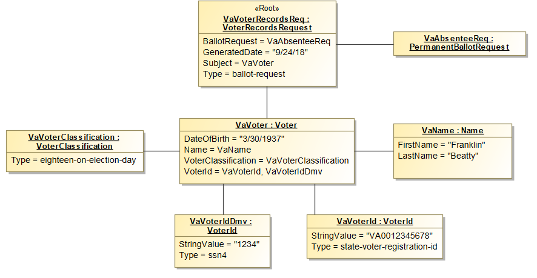

# Object Diagram (M0) to JSON

This VTL report converts a set MagicDraw Instance Specifications into an equivalent set of JSON representations.

## Method of Transformation

All data in an object instance is stored in one or more `slots`. `Slots` store things such as attributes, and associations.

Each slot is converted to a property of the same name.

To maintain compatibility with NIST 1500 generated JSON Schemas, each generated object contains the property `@type` containing the value in the form of `{Package}.{ClassName}`.

Each object instance will result in a separate JSON property named the same as the object, and whose value is the object and its dereferenced associations.

```json
{
    "@type": "VRI.VoterClassification"
}
```

## Example



The above UML Model translates to the following JSON code.

```json
{
    "@type": "VRI.VoterRecordsRequest",
    "Subject": {
        "@type": "VRI.Voter",
        "VoterClassification": [
            {
                "@type": "VRI.VoterClassification",
                "Type": "eighteen-on-election-day"
            }
        ],
        "VoterId": [
            {
                "@type": "VRI.VoterId",
                "Type": "state-voter-registration-id",
                "StringValue": "VA0012345678"
            },
            {
                "@type": "VRI.VoterId",
                "Type": "ssn4",
                "StringValue": "1234"
            }
        ],
        "Type": [
            "registration"
        ],
        "Name": {
            "@type": "VRI.Name",
            "FirstName": "Franklin",
            "LastName": "Beatty"
        },
        "DateOfBirth": "3/30/1937"
    },
    "Type": [
        "ballot-request"
    ],
    "BallotRequest": {
        "@type": "VRI.PermanentBallotRequest",
    },
    "GeneratedDate": "9/24/18"
}
```

## Associations

All references (e.g. directed associations) are dereferenced to form a single JSON instance.

## Handling of Multiplicities

Attributes or associations at M1 having a multiplicity with a upper cardinality of greater than 1 are generated as arrays.